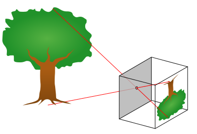

# Pinhole camera and Lens

## 針孔成像
在一般的照相機的光學系統，其模型可以從一最簡單的針孔相機開始講起。當我們在建立針孔成像的模型時，我們總是會假定其針孔是足夠的小，讓光線從物體光源出發到達像面時，其抵達之位置幾乎一致以保持成像清晰。如下圖：

## 鏡頭存在的必要與需要付出的代價
那既然可以成像，為何不乾脆直接在機構上直接打個孔洞就好，為何需要鏡頭？這個答案若讓筆者來回答，筆者主要認為是進光量不足的緣故。要了解現代相機的作用已經不只是拍攝相片，若曝光的時間需達數秒以上，那我們要如何拿其錄製FPS 120Hz的影片？這是不可接受的，也因此我們會需要鏡頭這個聚光用的元件。

然而，要在針孔成像的光學系統中加入鏡片，勢必要付出一些代價。例如：原先只要透過簡單的相似三角形的關係，便可簡單計算出該針孔相機的系統長度與視角之間的關係，而加入鏡片後則不可如此計算。因此，相機的長度便需要進行模擬計算去取得。

再來，由於要聚光的緣故，光線便會出現偏折，以導致光線會跑到我們不希望其出現的位置，進而造成場曲與畸變的產生。

